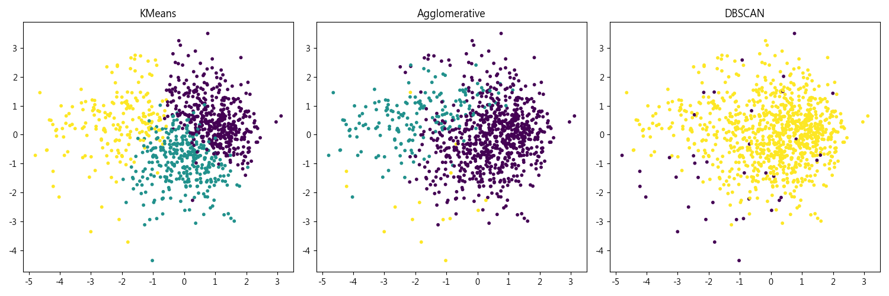

# ScikitLearn 操作記錄單 3

**組別:** 10    **學號:** 41247008S    **姓名:** 鄭兆宏

## Unsupervised Learning

### 1. Clustering Module Function

#### Sklearn.cluster KMeans()

**程式碼:**
```python
kmeans = KMeans(n_clusters=3, random_state=42)
kmeans_labels = kmeans.fit_predict(data_scaled)
print(f"KMeans Inertia: {kmeans.inertia_:.2f}")
```
**結果:** Inertia: 5702.87
**說明:** KMeans 執行速度快，Inertia 數值反映了群內緊密度。

#### Sklearn.cluster AgglomerativeClustering()

**程式碼:**
```python
agg = AgglomerativeClustering(n_clusters=3)
agg_labels = agg.fit_predict(data_scaled)
```
**說明:** 階層式分群，結果與 KMeans 類似，但計算較慢。

#### Sklearn.cluster DBSCAN()

**程式碼:**
```python
dbscan = DBSCAN(eps=2.0, min_samples=5)
dbscan_labels = dbscan.fit_predict(data_scaled)
```
**說明:** 參數敏感。eps=2.0 時只分出一群主要群聚，其餘為雜訊，顯示資料密度分佈均勻。

---

### 2. Clustering Evaluation

#### Sklearn.metrics.cluster normalized_mutual_info_score()

**說明:** 本次使用 Spotify 資料集無 Ground Truth，故無法計算 NMI。

#### Sklearn.metrics.cluster silhouette_score()

**程式碼:**
```python
sil_score = silhouette_score(data_scaled, kmeans_labels)
```
**結果:**
- KMeans: 0.15
- Agglomerative: 0.20
- DBSCAN: 0.44 (僅一群)

**說明:** 分數偏低 (0.15~0.2) 表示歌曲風格界線模糊。DBSCAN 分數高是因為排除了鬆散點。

---

### 3. 音樂資料集分群報告

**資料來源:** Kaggle "Top Spotify Songs 2023" (`spotify-2023.csv`)
**特徵:** `bpm`, `danceability_%`, `energy_%` 等音樂特徵。
**前處理:** 移除缺失值，使用 `StandardScaler` 標準化。

**分析:**
1.  **KMeans / Agglomerative:** 將歌曲分為 3 類，推測為「舞曲」、「慢歌」與「中間值」。
2.  **DBSCAN:** 難以區分邊界，適合用於找離群值。
3.  **結論:** KMeans 最適合此類資料。

**程式碼連結:** https://github.com/twdanielcheng112/Data-Mining-HW10/blob/main/solve_hw10.py

**視覺化結果:**

