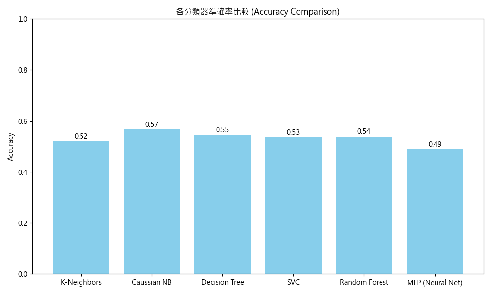
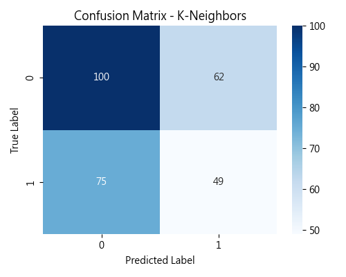
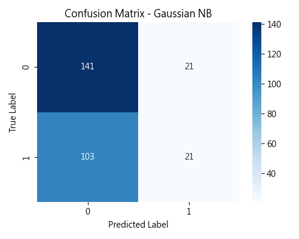
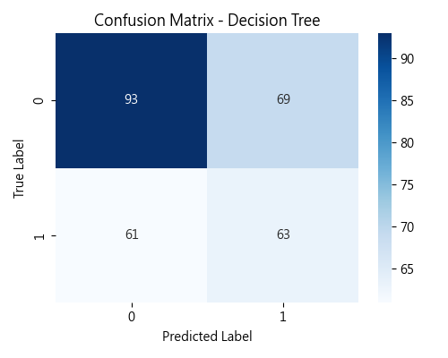
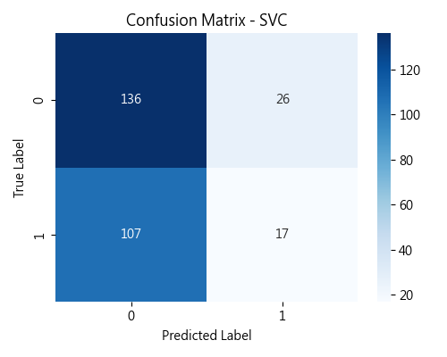
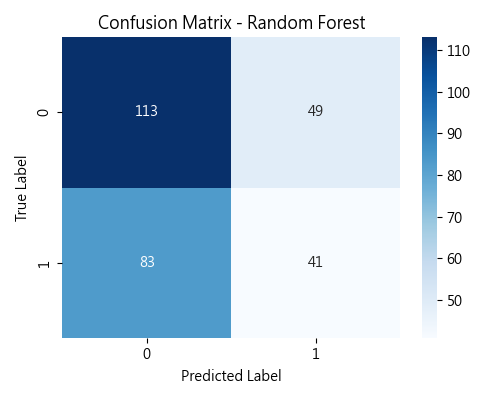

# ScikitLearn 操作記錄單 2

**組別:** 10    **學號:** 41247008S    **姓名:** 鄭兆宏

## Supervised Learning - Classification

### 1. Classification Module Function

以下針對 Scikit-learn 的 Classification 模組進行操作與實驗。

#### K-Neighbors Classification
**模組:** `sklearn.neighbors.KNeighborsClassifier`
**程式碼:**
```python
knn = KNeighborsClassifier(n_neighbors=5)
knn.fit(X_train_scaled, y_train)
y_pred = knn.predict(X_test_scaled)
```
**說明:** 使用 K 最近鄰演算法，設定 K=5。

#### Naïve Bayes Classifiers
**模組:** `sklearn.naive_bayes.GaussianNB`
**程式碼:**
```python
gnb = GaussianNB()
gnb.fit(X_train_scaled, y_train)
y_pred = gnb.predict(X_test_scaled)
```
**說明:** 使用高斯單純貝氏分類器，假設特徵呈現高斯分佈。

#### Decision Trees Classification
**模組:** `sklearn.tree.DecisionTreeClassifier`
**程式碼:**
```python
dt = DecisionTreeClassifier(random_state=42)
dt.fit(X_train_scaled, y_train)
y_pred = dt.predict(X_test_scaled)
```
**說明:** 使用決策樹進行分類。

#### SVM Classification
**模組:** `sklearn.svm.SVC`
**程式碼:**
```python
svc = SVC(kernel='rbf', random_state=42)
svc.fit(X_train_scaled, y_train)
y_pred = svc.predict(X_test_scaled)
```
**說明:** 使用支援向量機 (SVM)，核心函數設為 RBF。

#### Ensemble Classifier (Random Forest)
**模組:** `sklearn.ensemble.RandomForestClassifier`
**程式碼:**
```python
rf = RandomForestClassifier(n_estimators=100, random_state=42)
rf.fit(X_train_scaled, y_train)
y_pred = rf.predict(X_test_scaled)
```
**說明:** 使用隨機森林，由多棵決策樹組成。

#### ANN Classification (MLP)
**模組:** `sklearn.neural_network.MLPClassifier`
**程式碼:**
```python
mlp = MLPClassifier(hidden_layer_sizes=(100,), max_iter=500)
mlp.fit(X_train_scaled, y_train)
y_pred = mlp.predict(X_test_scaled)
```
**說明:** 使用多層感知機 (類神經網路)。

---

### 2. Evaluation & Results

以下為各分類器在測試集上的準確率 (Accuracy) 與混淆矩陣 (Confusion Matrix)。

#### 準確率比較
- **Gaussian NB:** 0.5664 (最高)
- **Decision Tree:** 0.5455
- **Random Forest:** 0.5385
- **SVC:** 0.5350
- **K-Neighbors:** 0.5210
- **MLP (Neural Net):** 0.4895



#### 詳細評估 (Confusion Matrix)

| K-Neighbors | Gaussian NB |
| :---: | :---: |
|  |  |

| Decision Tree | SVC |
| :---: | :---: |
|  |  |

| Random Forest | MLP |
| :---: | :---: |
|  | .png) |

---

### 3. 音樂資料集分類報告

**資料來源:** Kaggle "Top Spotify Songs 2023" (`spotify-2023.csv`)
**分類目標:** 預測歌曲的調性 **Mode** (Major=0 / Minor=1)。
**使用特徵:** `bpm`, `danceability_%`, `valence_%`, `energy_%`, `acousticness_%`, `instrumentalness_%`, `liveness_%`, `speechiness_%`。

**資料前處理:**
1.  **讀取資料:** 使用 Pandas 讀取 CSV。
2.  **特徵選取:** 選取 8 個數值型音樂特徵。
3.  **目標編碼:** 使用 `LabelEncoder` 將 `mode` 欄位轉為數值 (Major -> 0, Minor -> 1)。
4.  **缺失值處理:** 移除含有缺失值的資料列。
5.  **資料儲存:** 前處理後的資料已儲存為 `processed_spotify_data.csv`。
6.  **資料標準化:** 使用 `StandardScaler` 將特徵縮放至平均值為 0，標準差為 1，以利 SVM 與 KNN 等模型訓練。

**綜合分析:**
1.  **整體表現:** 所有分類器的準確率皆在 50% ~ 56% 之間，略高於隨機猜測 (50%)。這顯示僅憑基本的音樂特徵 (如 BPM、能量、舞曲度) 很難準確預測歌曲是大調還是小調。
2.  **最佳模型:** 本次實驗中，**Gaussian Naive Bayes** 表現最佳 (Accuracy: 0.57)，這可能意味著各特徵在不同類別下的分佈稍微符合高斯分佈的假設。
3.  **模型比較:** 複雜的模型 (如 Random Forest, MLP) 並沒有表現得比簡單模型 (Naive Bayes) 好，甚至 MLP 表現最差，這可能是因為資料特徵與目標之間的關聯性本身就不強，或者資料量不足以訓練複雜模型。

**程式碼連結:** https://github.com/twdanielcheng112/Data-Mining-HW10/blob/main/HW8/solve_hw8.py
